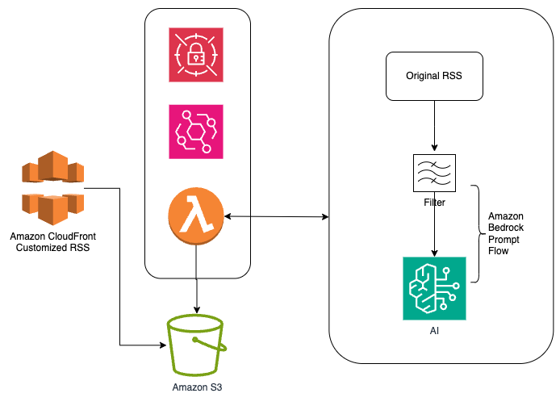

# Customed-RSS-feed-with-Amazon-Bedrock(AWSNews): Intelligent AWS News Distribution with Amazon Bedrock Flows

## Overview

Customed-RSS-feed-with-Amazon-Bedrock(AWSNews) leverages Amazon Bedrock flows to automate the process of filtering and distributing relevant AWS news to customer technical teams, ensuring only the most pertinent updates reach the right audience.

## Solution Architecture

The AWSNews solution uses a serverless architecture that combines:
- Amazon S3 (for storage)
- AWS Lambda (for processing)
- Amazon Bedrock (for intelligent filtering and contextualization)
- Amazon CloudFront (for content distribution)

The solution architecture is illustrated below:



## How It Works

1. **RSS Feed Ingestion**: The system retrieves the latest AWS news from the official AWS RSS feed.
2. **Deduplication and Storage**: Two XML files are maintained in Amazon S3 to track processed and relevant news items.
3. **Intelligent Filtering**: Amazon Bedrock's flow analyzes news content for relevance.
4. **Dynamic RSS Feed Generation**: New RSS entries are generated with added context for relevant items.
5. **Distribution**: Updates are distributed via Amazon CloudFront, with flexibility for integration into additional platforms.


## Key Features

- **Customizable Intelligence**: Leverages Amazon Bedrock’s flows to filter and contextualize AWS news based on customer needs.
- **Scalable Processing**: Efficiently processes high volumes of news items.
- **Continuous Learning**: The solution refines its filtering capabilities over time.
- **Flexible Integration**: Easily integrates with additional AWS services for extended functionality.

## Deployment

To deploy this solution, use the following steps with the AWS SAM (Serverless Application Model):

0. **prerequisit Python 3.12 and SAM (optional)**
   - Python 3.12: https://www.python.org/downloads/release/python-3120/
   - AWS Serverless Application Model: https://docs.aws.amazon.com/serverless-application-model/latest/developerguide/install-sam-cli.html

1. **create feedparser_layer.zip into the main folder which is to be used for AWS Lambda Layer**
   ```bash
   cd feedparser_layer
   chmod +x bash-script.sh
   ./bash-script.sh
   cd ..
   ```
2. **Build the SAM Application:**
   ```bash
   sam build
   ```
   This command compiles and prepares the application code for deployment, packaging dependencies as needed.

3. **Deploy the SAM Application:**

   ```bash
   sam deploy --guided
   ```
   Follow the prompts to configure your deployment. You’ll specify parameters such as your S3 bucket, CloudFormation stack name, and region.

4. **Delete the Application:**

   ```bash
   sam delete
   ```
   This command cleans up resources created by the deployment, removing the stack from your AWS environment.

## Benefits
Customizable Intelligence: Adaptable to specific business requirements for news distribution.
Scalability: Efficient processing at scale without compromising analysis quality.
Continuous Improvement: Learns from ongoing data to improve relevance filtering.
AWS Service Integration: Easily extends to integrate with other AWS services.

## Conclusion
Customed-RSS-feed-with-Amazon-Bedrock(AWSNews) demonstrates Amazon Bedrock's flows capability to intelligently filter and distribute relevant AWS news. By ensuring customers receive actionable information, AWSNews empowers technical teams with timely, curated insights.

We welcome feedback and encourage you to share innovative uses of this solution in real-world scenarios.